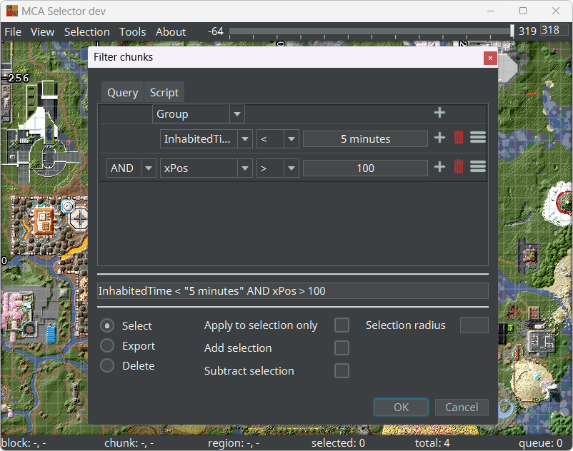
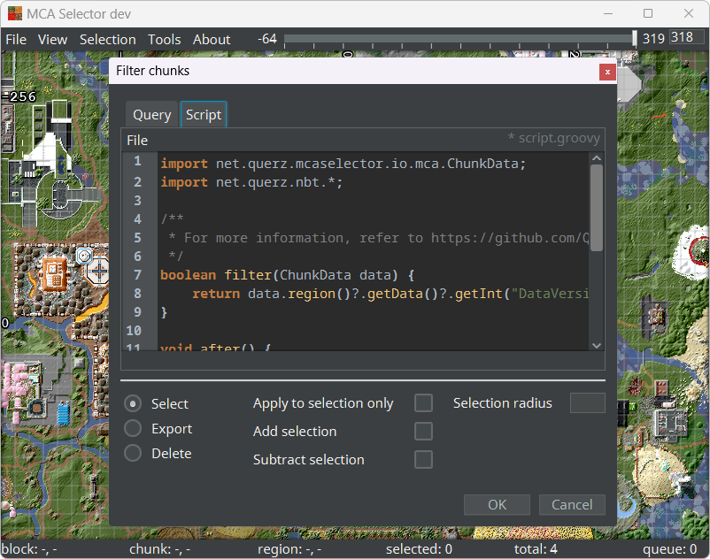

MCA Selector contains a powerful tool to select, export or delete chunks and regions by conditions like the data
version, the time it was last updated, how much time players have spent in this chunk and some more. Multiple of
these conditions can be chained together to create a very specific query describing what chunks and regions should be 
selected, exported or deleted.

<p align="center">
  
</p>

---

## Filter types

Because the conditions use internal values used by Minecraft, the following table gives a brief explanation on what
they do:

| Condition      | Type       | Description                                                                                                                                                                                                                                                                                                                                                                                                                                        |
|----------------|------------|----------------------------------------------------------------------------------------------------------------------------------------------------------------------------------------------------------------------------------------------------------------------------------------------------------------------------------------------------------------------------------------------------------------------------------------------------|
| Group          | -          | Groups multiple conditions.                                                                                                                                                                                                                                                                                                                                                                                                                        |
| Not Group      | -          | A negated group.                                                                                                                                                                                                                                                                                                                                                                                                                                   |
| DataVersion    | int        | The DataVersion tag of the chunk. 100-1343 for 1.12.2 and below, 1444 for 1.13 snapshots and above.                                                                                                                                                                                                                                                                                                                                                |
| InhabitedTime  | long       | The total amount of time in game-ticks players have spent in that chunk. 1 second is ~20 ticks. Also accepts a duration string such as `1 year 2 months 3 days 4 hours 5 minutes 6 seconds`.                                                                                                                                                                                                                                                       |
| xPos           | int        | The location of the chunk on the x-axis in chunk coordinates.                                                                                                                                                                                                                                                                                                                                                                                      |
| yPos           | int        | The location of the lowest section of this chunk. Introduced with DataVersion 2844 (21w43a).                                                                                                                                                                                                                                                                                                                                                       |
| zPos           | int        | The location of the chunk on the z-axis in chunk coordinates.                                                                                                                                                                                                                                                                                                                                                                                      |
| Timestamp      | int        | The time a chunk was last saved in epoch seconds. Also accepts a timestamp in the `yyyy-MM-dd HH-mm-ss`-format such as `2018-01-02 15:03:04`. If the time is omitted, it will default to `00:00:00`.                                                                                                                                                                                                                                               |
| Compression    | String/int | The compression method to use. Supported values: `GZIP`, `ZLIB`, `UNCOMPRESSED`, `LZ4`, and their .mcc equivalents (when saving a single chunk in an .mcc file, with the suffix `_EXT`. The raw signed byte values are also supported: `1`, `2`, `3`, `4`, `-127`, `-126`, `-125`, and `-125`.                                                                                                                                                     |
| LastUpdate     | long       | The time a chunk was last saved in ticks since world creation. 1 second is ~20 ticks. Also accepts a duration string such as `1 year 2 months 3 days 4 hours 5 minutes 6 seconds`.                                                                                                                                                                                                                                                                 |
| Palette        | String     | A list of comma (,) separated 1.13 block names. The block names will be converted to block ids for chunks with DataVersion 1343 or below. The validation of block names can be skipped by writing them in single quotes ('). Example: `sand,'new_block',gravel`.                                                                                                                                                                                   |
| Biome          | String/int | One or multiple biome names and IDs, separated by comma (,). For a reference of biome names and IDs, have a look at the [Wiki](https://minecraft.wiki/Java_Edition_data_values#Biomes). Custom biomes can be specified by using single quotes (') around a biome ID.                                                                                                                                                                               |
| Status         | String     | The status of the chunk generation. Only recognized by Minecraft 1.13+ (DataVersion 1444+)                                                                                                                                                                                                                                                                                                                                                         |
| PlayerLocation | String     | Loads player locations from a directory containing player data files. The syntax is the following: `<directory><path-separator><dimension>`. `directory` is the path to the player data files, `path-separator` is the path separator used on the current OS to separate paths (`;` on Windows, `:` on Mac / Linux) and `dimension` is the dimension of the player location, e.g. `minecraft:overworld` (or e.g. `1` in older Minecraft versions). |
| PlayerSpawn    | String     | Loads player spawn locations from a directory containing player data files. The syntax is identical to the `PlayerLocation` filter.                                                                                                                                                                                                                                                                                                                |
| Selection      | String     | The path to a .csv file containing a selection.                                                                                                                                                                                                                                                                                                                                                                                                    |
| LightPopulated | byte       | Whether the light levels for the chunk have been calculated. If this is set to 0, converting a world from 1.12.x to 1.13 will omit that chunk. Allowed values are `0` and `1`.                                                                                                                                                                                                                                                                     |
| Entities       | String     | One or multiple entity names, separated by comma (,). For a reference of entity names, have a look at the [Wiki](https://minecraft.wiki/Java_Edition_data_values#Entities). Custom entities are supported, though they must be declared in single quotes (') and with their namespace id.                                                                                                                                                          |
| Structures     | String     | One or multiple structure names, separated by comma (,). A list of all valid structure names can be found [here](https://github.com/Querz/mcaselector/blob/master/src/main/resources/mapping/all_structures.txt). Custom structures are supported, though they must be declared in single quotes (').                                                                                                                                              |
| #Entities      | int        | The total amount of entities in that chunk.                                                                                                                                                                                                                                                                                                                                                                                                        |
| #ProtoEntities | int        | The total amount of proto entities in that chunk.                                                                                                                                                                                                                                                                                                                                                                                                  |
| #TileEntities  | int        | The total amount of tile entities / block entities in that chunk.                                                                                                                                                                                                                                                                                                                                                                                  |
| Circle         | String     | Creates a circular selection starting at a center point with a specific radius. Syntax: `<center-x>;<center-z>;<radius>`. The center coordinates are chunk coordinates and the radius is measured in chunks. Multiple circles can be chained with a comma (,).                                                                                                                                                                                     |
| Border         | int        | Selects all chunks where the number of empty neighboring chunks is equal or larger than the specified number. This filter can only be used to create selections.                                                                                                                                                                                                                                                                                   |
| Custom         | String     | A custom one-line groovy script returning a boolean. For backwards compatibility. It is generally recommended to use the Script Editor instead.                                                                                                                                                                                                                                                                                                    |

---

## Filter string

A string representation of the query is printed in a text field below the query editor. When entering a query into
this field directly, press `Enter` to parse it into the query editor.

## Options

### Select

When this option is selected, a selection will be created for all chunks matching this filter. When this option is 
selected, `Selection radius` can also be set. Setting the selection radius will additionally select all chunks in 
every direction (north, south, east and west) with this distance.

### Export

All chunks matching this filter will be exported into a new empty folder. This will create a new `region`, `poi` and 
`entities` folder if necessary. A selection will not be created and the original files will not be changed.

### Delete

All chunks matching this filter will be deleted in the original files. This operation is instant and there is no 
going back. **Make sure to make a backup before deleting chunks!**

---

## Region Checking

Some filters have the ability to check the `.mca`-file name first before opening the file to avoid unnecessarily
loading the entire file. This only works if the filter query is logically structured in a way that allows this.

For example, the query `xPos > 0 AND InhabitedTime > "5 minutes"` will completely skip all `.mca`-files with a negative
x-value, but the query `xPos > 0 OR InhabitedTime > "5 minutes"` will load all files.

---

## Script

<p align="center">
  
</p>

The second tab in the Filter dialog is for custom scripts. Here, you can create your own Groovy script to filter for
different values in each chunk. Scripts can be saved and loaded independently using the Script Editor's `File` menu.

This is the most basic script:

```Groovy
import net.querz.mcaselector.io.mca.ChunkData;
import net.querz.nbt.*;

boolean filter(ChunkData data) {
	return true;
}
```

But more functions are supported. This is the extended script with all supported functions:

```Groovy
import net.querz.mcaselector.io.mca.ChunkData;
import net.querz.nbt.*;

boolean filter(ChunkData data) {
	return true;
}

void before() {
	
}

void after() {
	
}

boolean matchesRegion(int x, int z) {
	return true;
}
```

### boolean filter(ChunkData data)

This function returns a boolean whether the current chunk should be selected, deleted or exported. [ChunkData](https://github.com/Querz/mcaselector/blob/master/src/main/java/net/querz/mcaselector/io/mca/ChunkData.java)
contains references to the chunk data from the `region`-, `entities`-, and `poi`-files. For example, to check for a
chunk's `DataVersion`, the following script can be used:

```Groovy
boolean filter(ChunkData data) {
	return data.region()?.getData()?.getInt("DataVersion") > 1234;
}
```

### void before()

This function runs *ONCE* before filtering starts. It can be used to e.g. load additional data from a file.

### void after()

This function runs *ONCE* after filtering ends. It can be used to e.g. save accumulated data to a file.

### boolean matchesRegion(int x, int z)

This function can be used to skip certain region files entirely, based on their region coordinates. For example, the
following script can be used to skip any regions where the x-coordinate is negative:

```Groovy
boolean matchesRegion(int x, int z) {
	return x >= 0;
}
```

## Existing scripts

[Here](https://github.com/arvitus/mcascripts) is an awesome source for existing scripts, such as a
[script to find specific entities based on their NBT data and save their locations to a file](https://github.com/arvitus/mcascripts/blob/main/filters/FindMobs.groovy).